# Minecraft-Bedrock-Backup-PowerShell

"🇪🇸 ¿Hablas español? The GitHub repository includes a complete step-by-step guide in Spanish! / ¡El repositorio también incluye una guía visual paso a paso totalmente en español!"

## 1. Purpose and Problem Solved

This script automates the backup process for Minecraft Bedrock worlds on Windows. Leveraging **PowerShell**, it identifies your world folders, packages them individually into the native `.mcworld` format, and syncs them directly to your **OneDrive** account configured on your system.

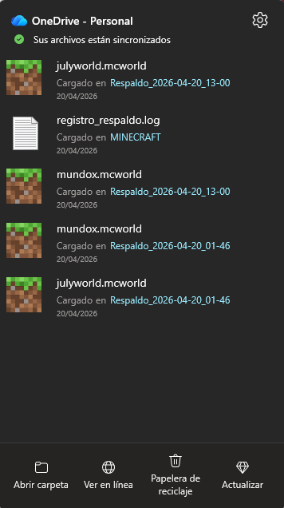

### Why I built this
This project was born from my journey learning **Bash** and discovering the power of scripting. I needed a practical solution for Windows to achieve:
* **Data Integrity:** Maintaining a backup history to prevent progress loss due to corrupted updates, mod errors, or accidental deletion.
* **Cross-Platform Play:** By generating `.mcworld` files, you can easily download your backups from OneDrive and import them instantly onto Android or iPadOS devices.

*Development Note: Since my primary background is in Bash, I collaborated with **Gemini** to translate my logic into PowerShell syntax. This allowed me to build a robust tool while gaining a deep understanding of how each command handles file compression and game data management.*

> **Note on the Interface:** The screenshots in this guide feature a Spanish Windows interface (my native OS language), but the layout, icons, and button positions are exactly the same in all languages.

## 2. Prerequisites

For the script to run and sync smoothly, your environment must meet the following requirements:

* **Microsoft Account:** You must be logged into a Microsoft account on your operating system.
* **OneDrive Installed:** The OneDrive desktop application must be installed and linked to your account.
* **OneDrive as a Startup App:** You must enable OneDrive to run at startup to ensure background syncing is always active.
  
  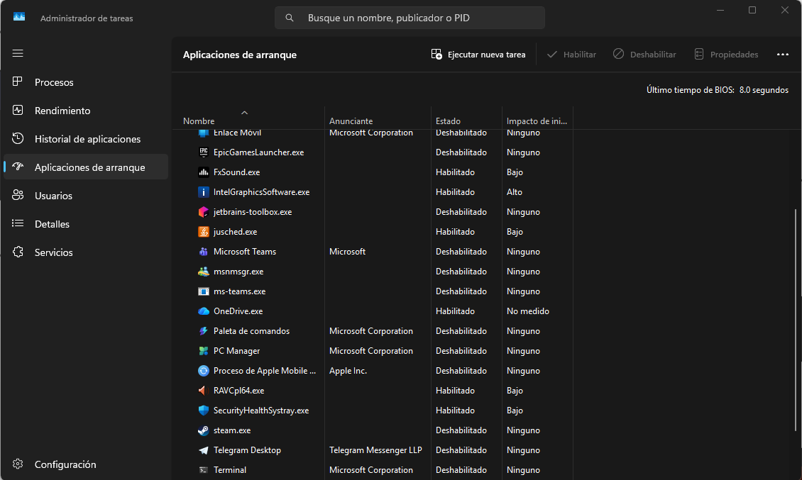

* **Destination Folder in OneDrive:** Create or ensure you have a folder named `MINECRAFT` located in the root of your OneDrive directory. *(Note: The script is programmed to create this automatically if it doesn't exist, but it is good practice to verify its location).*
  
  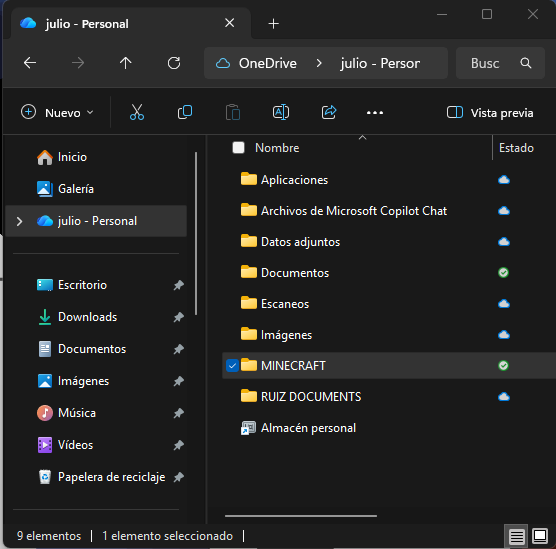

* **Source Folder on your PC:** Verify your local path and make sure your Minecraft Bedrock worlds folder exists in its default location on your machine.
  
  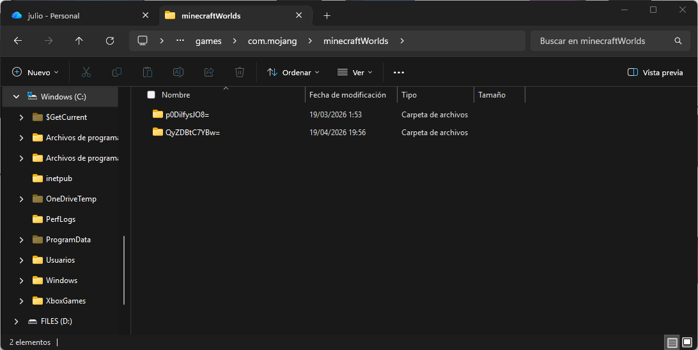

## 3. Automating the Execution

To avoid running the backups manually, we will configure Windows to execute the script (`Minecraft-Backup-PowerShell-V1.ps1`) for you quietly in the background.

### 3.1. Open the Task Scheduler
Search for **"Task Scheduler"** in your Windows Start menu and open the application. On the right-hand panel (under the *Actions* menu), click on **Create Task...** (Make sure to select "Create Task" and not "Create Basic Task"). This will open a new window with several tabs where we will configure the automation.

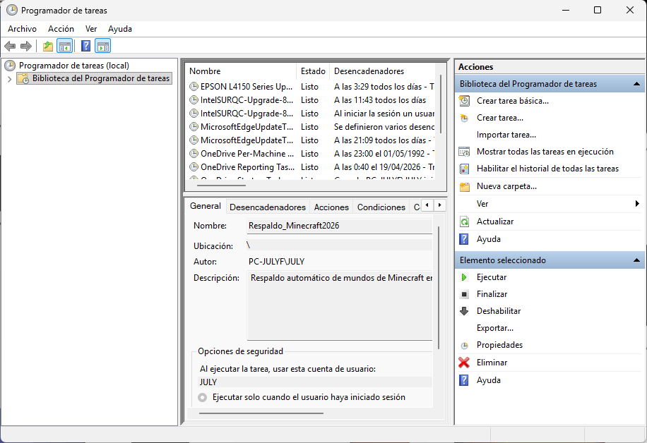

### 3.2. General Tab Settings

Once the new task window is open, in the **General** tab, we will configure the basic identity and permissions for the task:
* **Name:** Provide an identifiable name (e.g., "Minecraft Backup").
* **Description:** Add a brief description so you remember what the task does.
* **Security options:** Ensure you check **"Run only when user is logged on"** and, crucially, **"Run with highest privileges"**. The latter ensures PowerShell has the necessary permissions to compress and move the files without errors.

Leave the rest of the settings in this tab exactly as they are.

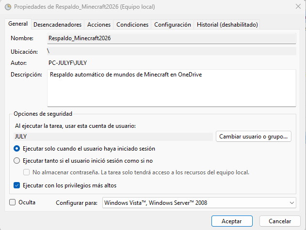

### 3.3. Triggers Tab Settings

Here we will configure the schedule and frequency for the script execution. In this tab, click the **New...** button at the bottom.

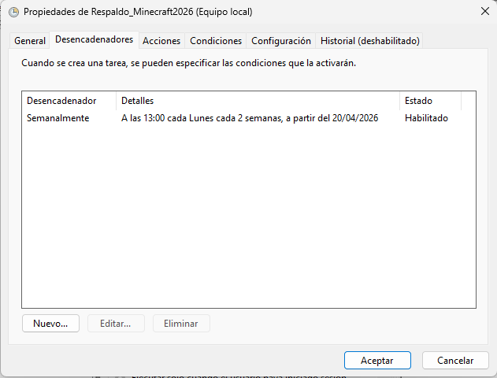

A new window called "New Trigger" will appear. Set it up as follows:

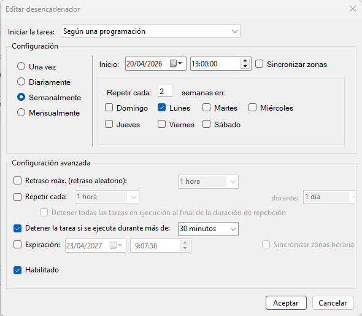

* **Begin the task:** Select **"On a schedule"**.
* **Frequency:** Choose how often you want the backup to run. In my setup, I selected **Weekly**.
* **Start and recurrence:** Set your preferred start date and time; the task will run at this exact time moving forward. Then, choose the weekly interval and specific days. I set mine to run **every 2 weeks, on Mondays**.
* **Advanced settings:** Check the box for **"Stop task if it runs longer than:"**. I set mine to **30 minutes**, but *please note: this depends entirely on the number and size of your worlds*. A large backup might take longer to compress, which doesn't mean the process is stuck or frozen. Adjust this time limit according to your needs.
* Finally, ensure the **"Enabled"** box at the bottom is checked, and click **OK**.

### 3.4. Actions Tab Settings

Here we will configure what the task will actually do. In this case, we need to launch PowerShell with high privileges and in the background, which will in turn execute our script. This method is required because Windows, by default, blocks the execution of `.ps1` scripts as a security measure.

Go to the **Actions** tab and click the **New...** button.

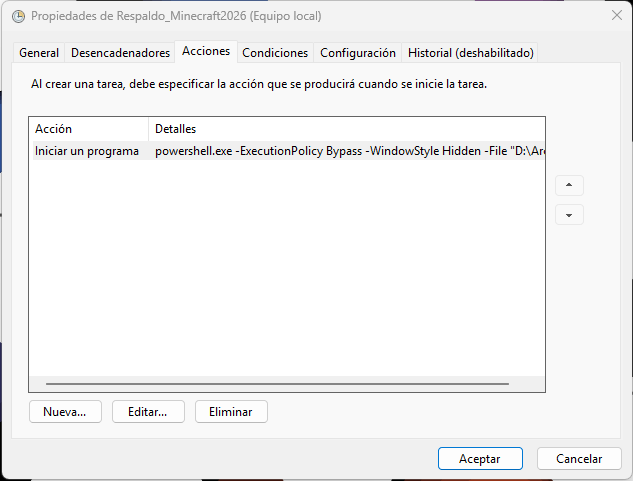

A "New Action" window will open. Set it up as follows:

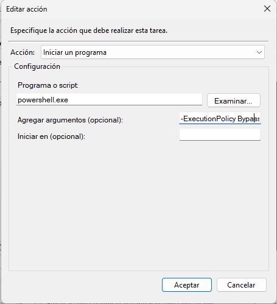

* **Action:** Select **"Start a program"**.
* **Program/script:** Type `powershell.exe`
* **Add arguments (optional):** Copy and paste the exact following line:

```powershell
-ExecutionPolicy Bypass -WindowStyle Hidden -File "PATH\Minecraft-Bedrock-Backup-PowerShell-V1.ps1"
```

> **(NOTE: It is crucial to know the exact folder where you saved the `.ps1` script. You must replace the word PATH in the line above with the actual directory path to that folder)**

Once you have pasted the line above with your adjusted path, click **OK**.

### 3.5. Conditions Tab Settings

In this tab, we must verify that **all options are unchecked**. This ensures that the script execution will not be stopped or skipped under any circumstances (such as power-saving modes or running on battery power on a laptop).

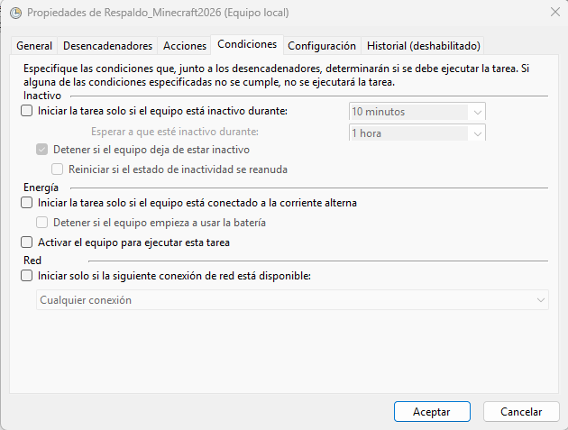

### 3.6. Settings Tab Configuration

Here we will configure the final behavior permissions for the task. Make sure you have the following options enabled and configured:

* **Allow task to be run on demand:** (This allows us to run the backup manually at any time).
* **Run task as soon as possible after a scheduled start is missed:** (Ensures the script runs later if it couldn't execute on time, for example, if the PC was turned off during the scheduled hour).
* **Stop the task if it runs longer than:** `30 minutes` (Again, this will depend on whether your worlds are very large or if you have many of them).
* **If the running task does not end when requested, force it to stop.**

Leave the rest of the options exactly as they are.

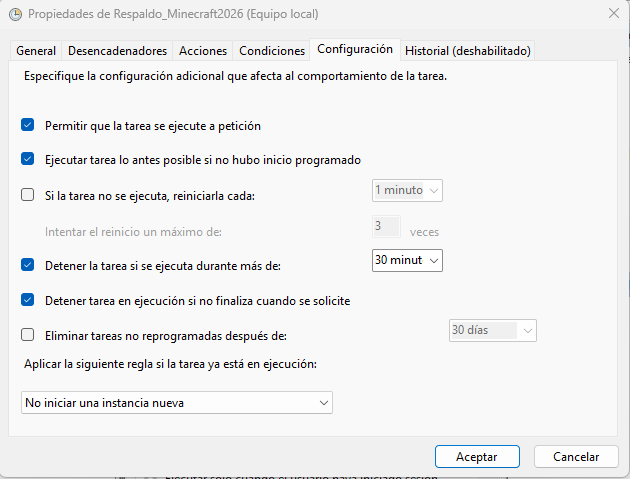

Once you have checked these settings, click **OK**. With this final step, we have successfully configured the complete automation of our script!

## 4. Testing the Backup

To verify that everything works correctly, we are going to manually run the script directly from the Task Scheduler.

1. On the main screen, click on **Task Scheduler Library**, located in the left-hand panel.
2. In the center panel, you will see a list of all scheduled tasks on your system. Find the task we just created and click on it to select it.
3. Finally, in the right-hand panel (under the *Selected Item* section), click on **Run**.

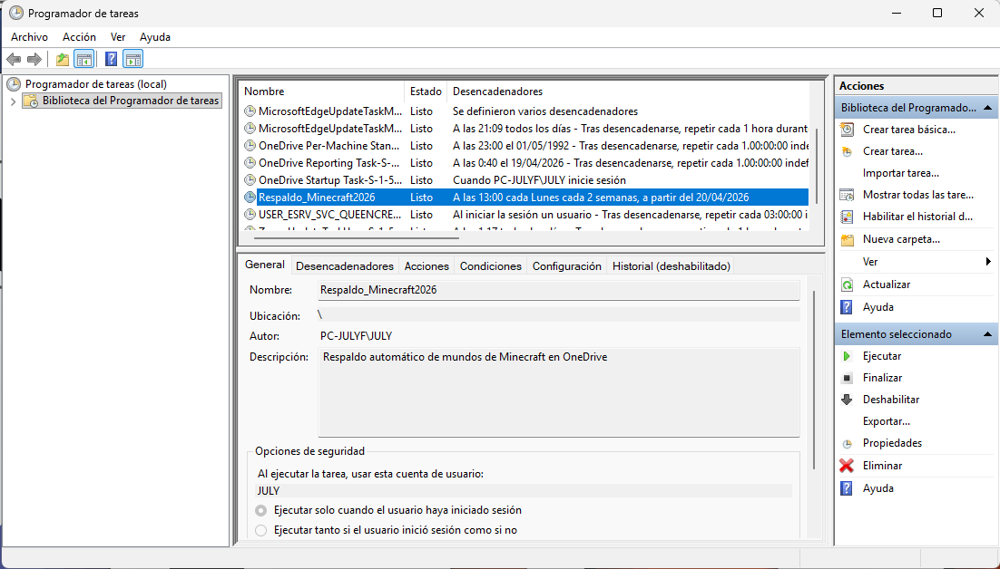

Once running, head straight over to your OneDrive folder. You will be able to see your worlds being backed up in real-time in the `.mcworld` format!

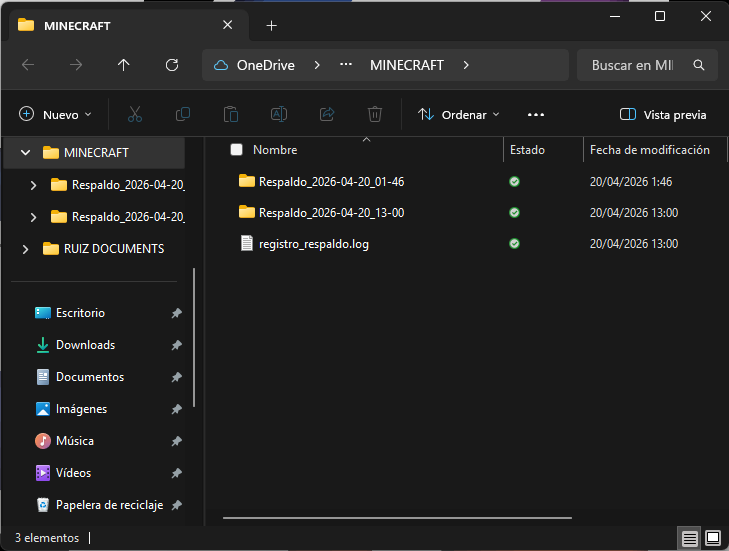

---
**You're all set!** Your automated backup system is successfully configured and running.
